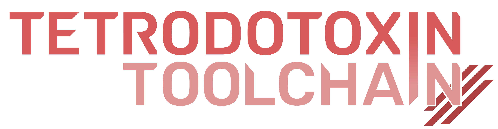
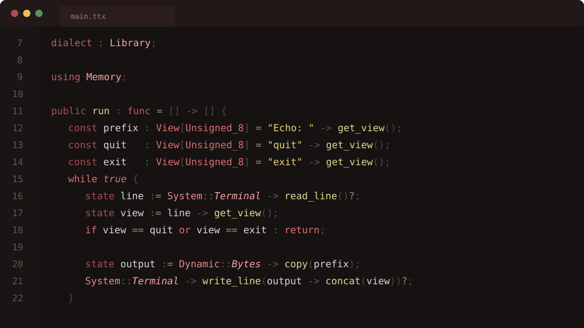

<p align="center">
  
</p>

> **The common layer should be meaning, not representation.**

Software stops feeling like one system when every domain brings its own parser,
package format, editor support, compiler driver, and private idea of the
program. The languages may work individually, but the people using them are
left to hold the project together.

Tetrodotoxin is built for the opposite experience. It lets a project use
several languages chosen for the work they describe while sharing one editor,
one Package graph, one linked understanding of the program, and one path to
finished products.

A package manifest can describe composition. Library source can express
executable behavior shared by CPU and GPU Terminals. An App can choose startup
policy. Scenes can own interactive state. Render contracts and Shaders can meet
around GPU work. Each language keeps the ideas that make it useful, and
Tetrodotoxin connects the meaning they genuinely share.



## One platform, several languages

Imagine adding a scene language to an engine without also inventing a new type
system, package manager, language server, build driver, and shader bridge. The
scene language should be able to own lifecycle and signals, reuse ordinary
Library code for behavior, and meet Render and Shader around graphics. The
editor should follow those relationships as naturally as the build does.

That is the kind of composition Tetrodotoxin is designed to make practical.

Tetrodotoxin calls each focused language a **Dialect**. A Dialect is more than a
grammar or a syntax skin. It owns the complete meaning of its domain and joins a
shared Workspace where other languages and tools can ask the questions they
have in common. Adding a Dialect gives a new domain a first class place in the
same project instead of placing another isolated compiler beside it.

The included Dialects show how that grows into a complete platform:

* **Package** makes sources, dependencies, resources, and durable Archives
  reproducible
* **Library** provides reusable executable code, data, and native interfaces
* **App** describes how a finished program starts and moves through its life
* **Scene** brings interactive state, lifecycle, signals, and graphics together
* **Render** defines the contract shared by a program and its GPU stages
* **Shader** implements that contract for GPU execution
* **Foreign** connects authored CPU code with an external ABI

These languages are a useful starting family rather than a closed list. A tool,
engine, or product can add languages for its own domains and let them
participate in the same experience.

## Build the language your system is missing

Some ideas never feel at home in a general purpose language. An asset recipe,
simulation graph, hardware protocol, deployment policy, or data transformation
may become clearer when its source speaks directly in the concepts its users
already understand.

Tetrodotoxin is intended to make creating that language the beginning of the
work rather than the beginning of a new toolchain. Its source can join existing
Packages, refer to Types and Callables from another Dialect, appear naturally in
the editor, and contribute meaning to more than one Terminal. A specialized
language can become a first class part of the product instead of a configuration
file interpreted at its edge.

## Share meaning without flattening it

Many extensible toolchains make languages cooperate by translating them into a
universal declaration tree or intermediate representation as early as
possible. That creates one convenient shape, but it also makes that shape the
authority. Anything richer becomes private metadata or disappears.

Tetrodotoxin takes a different route. The real object created by a language
remains the owner of its meaning. [TTX](ttx/README.md) gives tools and other
languages a small shared vocabulary for identity, resolution, Types, value
flow, Layouts, Addressables, Callables, source locations, and documentation.
The concrete object participates in those contracts without being copied into
a shadow model.

This is what Tetrodotoxin means by **raising**. Languages bring shared meaning
into one linked Workspace while keeping their richer domain model. Once that
meaning is complete, independent Terminals can derive the representations they
need. LLVM IR, SPIR-V modules, Package Archives, editor data, and executables are
products of the graph rather than replacements for it.

The design follows one practical guide:

> **Pull upward every fact that is target neutral and genuinely shared, while
> leaving richer meaning with its concrete owner.**

This does not replace **lowering**. It gives lowering a completed semantic
starting point. A target producer can carry that meaning into an MLIR pipeline,
LLVM IR, SPIR-V, or another representation domain, where ordinary progressive
lowering continues. LLVM IR can be Terminal relative to the Workspace while
remaining an intermediate representation for LLVM.

Terminal producers are the downstream counterpart to Dialects. Dialects
compose what a Toolchain can understand and raise into a Workspace. Terminal
producers compose what that Toolchain can produce from completed meaning. They
are parallel composition points with different ownership: a Dialect creates and
retains semantic meaning, while a Terminal producer consumes that meaning and
leaves the graph.

Lowering is one kind of Terminal production. Other producers project editor
information, serialize Package Archives, or compose native programs. Each one
owns the format and validation contract its next consumer needs.

## One understanding from editor to executable

Tetrodotoxin is intended to feel like a complete SDK rather than a collection
of compiler libraries.

The [Visual Studio Code extension](extension/README.md) understands the same
source identities used by the build. Hover, navigation, parameter hints,
formatting, diagnostics, and native debugging can therefore follow the real
program across Package members and language boundaries.

[Puffer](puffer/README.md) is the command and editor host. It assembles the
selected languages, opens a Workspace, and coordinates the requested products.
[Environment](tetrodotoxin/environment/README.md) keeps related source results
alive and completes their links. Backends begin at that completed meaning and
produce CPU code today, with the same boundary ready for Shader and SPIR-V.

[Standard Packages](packages/ttx/README.md) connect authored programs with
Memory, Math, System, and Graphics services. Perimortem supplies the native C++
runtime beneath those Packages and the generated programs. Tetrodotoxin is the
platform that brings the whole experience together.

## Find your way in

You can start with the part closest to what you want to build:

* [Project philosophy](PHILOSOPHY.md) explains the architectural ideas that let
  several languages share meaning without surrendering their own models
* [Contributing](CONTRIBUTING.md) turns those ideas into practical guidance for
  designing, documenting, reviewing, and validating changes
* [Tetrodotoxin overview](tetrodotoxin/README.md) follows several languages into
  one Workspace
* [Language integration](tetrodotoxin/language/README.md) shows how a new
  Dialect joins the platform
* [Library](tetrodotoxin/library/README.md) introduces the reusable execution language
* [App](tetrodotoxin/app/README.md), [Scene](tetrodotoxin/scene/README.md),
  [Render](tetrodotoxin/render/README.md), and
  [Shader](tetrodotoxin/shader/README.md) show how an application can span
  several domains
* [TTX](ttx/README.md) explains the shared semantic vocabulary and the
  meaning first philosophy behind it
* [Puffer](puffer/README.md) covers the command line and editor host

## Build and try the editor

The current development environment targets x86 64 Linux with Clang and Bazel.
Windowed applications use Wayland, while the Vulkan renderer uses the installed
Vulkan loader and driver.

Build the repository with:

```sh
bazel build //...
```

Run the complete unit suite with:

```sh
bazel run //validation:unit_tests --config=debug
```

Build the Visual Studio Code extension with:

```sh
./extension/package.sh
```

Adding `--install` installs the generated VSIX after packaging it.

## Project status

Tetrodotoxin is an active research and development platform. The long term goal
is a self contained SDK for editing, packaging, compiling, linking, and
debugging projects built from cooperating languages. The supported development
host today is x86 64 Linux with Wayland and Vulkan.

## License

Tetrodotoxin is available under the [MIT License](LICENSE).
