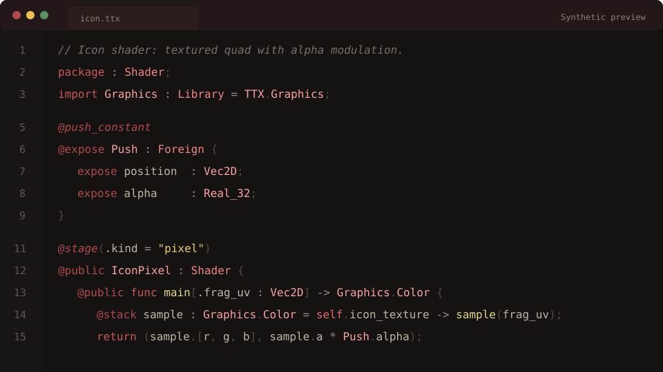

# Tetrodotoxin TTX

Language support for TTX, Perimortem's Tetrodotoxin source IR.



This preview is a static package asset built from TTX source text and the
extension color rules.

## Current Feature Set

- `.ttx` file association with the Tetrodotoxin language id.
- Bundled TTX TextMate grammar for syntax highlighting.
- Bundled red TTX color defaults for comments, sigils, attributes, types,
  members, functions, constants, strings, numbers, operators, and punctuation.
- Document formatting through the bundled Tetrodotoxin language server.
- Full-document synchronization with the language server for open `.ttx` files.
- Optional LSP semantic tokens for users who want editor semantic highlighting.
- Tetrodotoxin file icon for `.ttx` documents.

## Semantic Highlighting

Semantic tokens are disabled by default and can be turned on to override the
bundled TTX TextMate color scheme.

```json
{
  "tetrodotoxin.semanticHighlighting.enabled": true
}
```

## Bundled TTX Language Server

The extension packages the current `ttx-lang-server` binary for Linux machines.

## Not Yet Included

The current extension does not advertise completions, hover, go-to-definition,
references, or published diagnostics.
